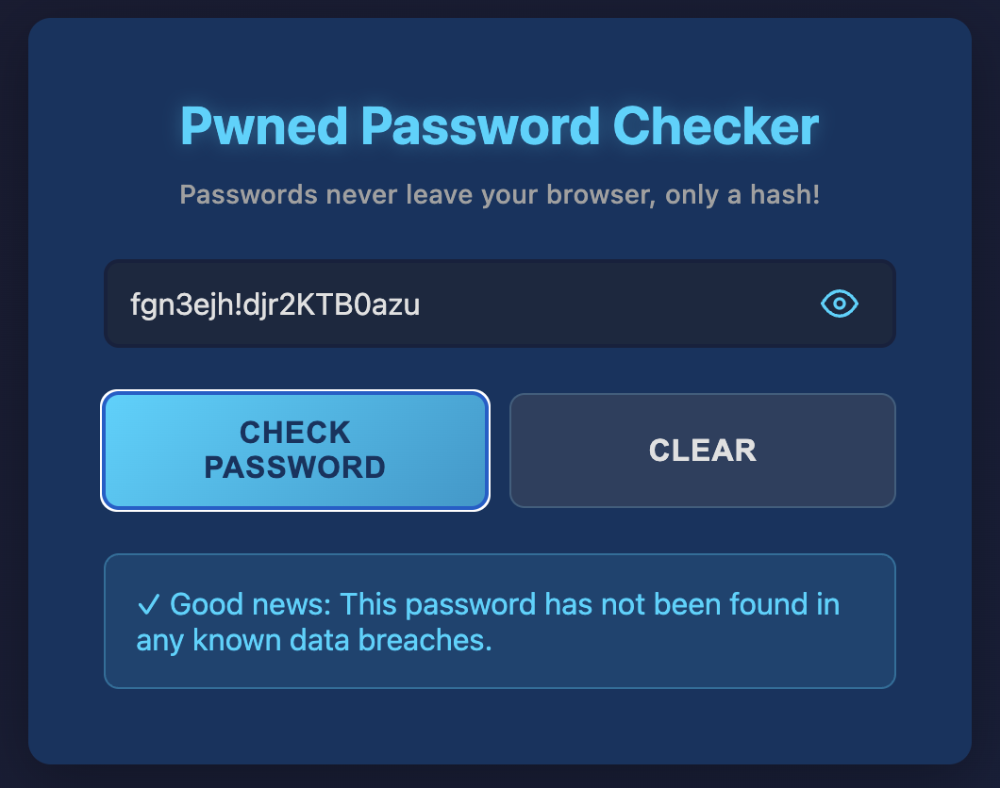
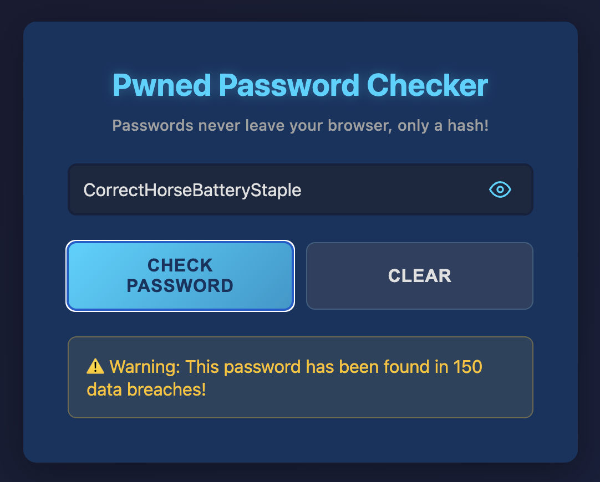

# selfhosted_pwned

A self-hostable WebUI for checking [HaveIBeenPwned](https://haveibeenpwned.com/), but without your password ever leaving your browser.

## Features

- **Privacy-First**: Passwords are hashed in your browser using SHA1. Only the hash prefix is sent to the server
- **No Password Transmission**: Your complete password never leaves your device
- **Self-Hosted**: Full control over your data and deployment
- **Simple UI**: Clean, intuitive interface with password visibility toggle
- **Real-time Checking**: Instantly check if a password has been compromised

## How It Works

This application uses the [HaveIBeenPwned Range API](https://haveibeenpwned.com/API/v3#SearchingPwnedPasswordsByRange) for secure password checking:

### The Privacy-Preserving Process

1. **Browser-Side Hashing**: When you enter a password, it's hashed to SHA1 (40 hex characters) entirely in your browser
2. **Prefix Extraction**: The first 5 characters of the hash (prefix) are sent to the server
3. **Range Query**: The server queries the HaveIBeenPwned API with only the 5-character prefix
4. **Suffix Matching**: The HaveIBeenPwned API returns all SHA1 hashes matching that prefix with their breach counts
5. **Client-Side Verification**: Your browser compares the remaining 35 characters (suffix) locally to find exact matches
6. **Result Display**: Only the breach count is shown - your actual password is never transmitted

### Why This Is Secure

- **k-anonymity**: By only sending the first 5 characters, you benefit from k-anonymity - the server cannot know which specific password you're checking among many possibilities
- **One-Way Hashing**: SHA1 is a one-way function; even if intercepted, hashes cannot be reversed to reveal passwords
- **No Server Storage**: Your server only makes API calls to HaveIBeenPwned and doesn't store any information about your queries

## Screenshots

### Random Password (Not Compromised)


### Compromised Password


## Running from GHCR

Pre-built images are available at `ghcr.io/tommyschnabel/selfhosted_pwned` and support both `amd64` and `arm64/v8` architectures.

### Using Docker Run

```bash
docker run -d -p 8080:8080 --name pwned ghcr.io/tommyschnabel/selfhosted_pwned
```

Then visit `http://localhost:8080` in your browser.

### Using Docker Compose

Create a `docker-compose.yml` file:

```yaml
version: '3.8'

services:
  pwned:
    image: ghcr.io/tommyschnabel/selfhosted_pwned:latest
    ports:
      - "8080:8080"
    restart: unless-stopped
```

Then run:

```bash
docker-compose up -d
```

## Building the Docker Image

### Prerequisites

- Docker installed on your system

### Quick Build

```bash
docker build -t selfhosted-pwned .
```

### Run the Container

```bash
docker run -d -p 8080:8080 --name pwned selfhosted-pwned
```

Then visit `http://localhost:8080` in your browser.

## Architecture

- **Frontend**: JavaScript/Node.js with Webpack bundling
- **Backend**: Go HTTP server
- **External API**: HaveIBeenPwned Range API (v3)

## API Endpoints

### `/api/check/hash` (POST)
Check if a SHA1 hash has been compromised.

Request:
```json
{
  "hash": "a94a8fe5ccb19ba61c4c0873d391e987982fbbd3"
}
```

Response:
```json
{
  "prefix": "a94a8",
  "found": true,
  "count": 3
}
```

### `/api/check/password` (POST)
Check if a password has been compromised (hashed server-side).

Request:
```json
{
  "password": "test"
}
```

Response:
```json
{
  "prefix": "a94a8",
  "found": true,
  "count": 3
}
```

## License

See LICENSE file for details.
